# 🚗 Dhaka Drive — Automobile Driving Training Institute

> A full-stack web-based management system for an automobile driving training institute, designed and developed as a System Analysis & Design project at **East West University**.

---

## 📋 Table of Contents

- [About the Project](#about-the-project)
- [Features](#features)
- [Tech Stack](#tech-stack)
- [Project Structure](#project-structure)
- [Database Schema](#database-schema)
- [System Design](#system-design)
  - [Use Case Diagram](#use-case-diagram)
  - [Activity Diagrams](#activity-diagrams)
  - [Class Diagram](#class-diagram)
  - [Data Flow Diagram](#data-flow-diagram)
  - [ER Diagram](#er-diagram)
  - [Sequence Diagram](#sequence-diagram)
- [Project Screenshots](#project-screenshots)
- [Installation & Setup](#installation--setup)
- [Courses Offered](#courses-offered)
- [Team Members](#team-members)
- [Limitations](#limitations)
- [License](#license)

---

## 📖 About the Project

**Dhaka Drive** is a comprehensive digital platform for managing all operations of an automobile driving training institute. It streamlines student registration, course enrollment, payment processing, schedule management, and instructor coordination — all in one centralized, user-friendly system.

The platform serves three user roles:
- **Learners (Students)** — Register, enroll in courses, make payments, track progress, and access learning materials.
- **Trainers (Instructors)** — Manage class schedules, record attendance, and update student progress.
- **Administrators** — Oversee all student records, vehicle allocation, exam scheduling, and certificate issuance.

---

## ✨ Features

### For Students / Learners
- 🔐 OTP-based account verification & secure login
- 📚 Browse and enroll in available driving courses
- 📅 Book and reschedule training sessions
- 💳 Online payment via bKash / Nagad gateway; offline cash payment option
- 📊 Track theory and practical training progress
- 📁 Download learning materials (BRTA guides, traffic signs, vehicle checklists)
- 💬 Submit support requests / message admin
- 🏆 Download completion certificates after passing exams

### For Trainers
- 🗓️ View and manage assigned class schedules
- ✅ Record student attendance and training progress
- 📝 Upload theory and practical test scores

### For Administrators
- 👤 Create and manage student & trainer accounts
- 🚗 Allocate vehicles and assign trainers to learners
- 📋 Approve enrollments and confirm payments
- 🔔 Send notifications to students
- 📊 View payment transactions and enrollment reports
- 🔒 Block, suspend, or deactivate user accounts

---

## 🛠 Tech Stack

| Layer       | Technology                        |
|-------------|-----------------------------------|
| Frontend    | HTML5, CSS3, JavaScript           |
| Backend     | PHP (Procedural)                  |
| Database    | MySQL (MariaDB)                   |
| Auth        | Session-based with OTP via email  |
| Payment     | bKash / Nagad (manual gateway)    |
| Server      | Apache (XAMPP / LAMP stack)       |

---

## 📁 Project Structure

```
dhakadrive/
├── index.php                  # Homepage / Landing page
├── login.php                  # Login page
├── dashboard.php              # Student dashboard
├── admin.php                  # Admin panel
├── notifications.php          # Notifications page
├── config.php                 # DB connection & helper functions
├── course-car.php             # Car Driving Course page
├── course-bike.php            # Motorcycle Riding Course page
├── course-scooter.php         # Scooter Riding Lessons page
├── course-bicycle.php         # Bicycle Safety Program page
├── actions/
│   ├── login_process.php      # Login handler (session, OTP)
│   ├── signup_process.php     # Registration handler
│   ├── otp_process.php        # OTP verification
│   ├── enroll_process.php     # Course enrollment handler
│   ├── submit_payment.php     # Payment submission
│   ├── schedule_class.php     # Class scheduling
│   ├── update_enrollment_status.php  # Admin enrollment approval
│   ├── update_user_status.php # Admin user management
│   ├── send_message.php       # Student messaging
│   ├── admin_reply.php        # Admin reply to messages
│   ├── submit_document.php    # Document upload
│   ├── update_profile.php     # Profile update
│   └── logout.php             # Logout handler
├── css/
│   └── style.css              # Main stylesheet
├── js/
│   ├── app.js                 # Frontend JavaScript
│   └── admin.js               # Admin panel JavaScript
├── materials/
│   ├── DhakaDrive-Traffic-Signs.pdf
│   ├── DhakaDrive-Vehicle-Checklist.pdf
│   └── DhakaDrive-BRTA-Guide.pdf
└── dhakadrive_db.sql          # Full database schema & seed data
```

---

## 🗄 Database Schema

The system uses a **MySQL** database (`dhakadrive_db`) with the following tables:

| Table            | Description                                          |
|------------------|------------------------------------------------------|
| `users`          | All users (students, admins) with roles & status     |
| `enrollments`    | Course enrollment records with status & scheduling   |
| `messages`       | Student–admin messaging system                       |
| `notifications`  | In-app notification records per user                 |
| `login_history`  | Tracks user login timestamps                         |

**Key relationships:**
- `enrollments.user_id` → `users.id` (CASCADE DELETE)
- `messages.user_id` → `users.id` (CASCADE DELETE)
- `notifications.user_id` → `users.id` (CASCADE DELETE)

**Default Admin Credentials:**
```
Email:    admin@dhakadrive.com
Password: (bcrypt hashed — reset on first deploy)
```

---

## 🧩 System Design

### Use Case Diagram

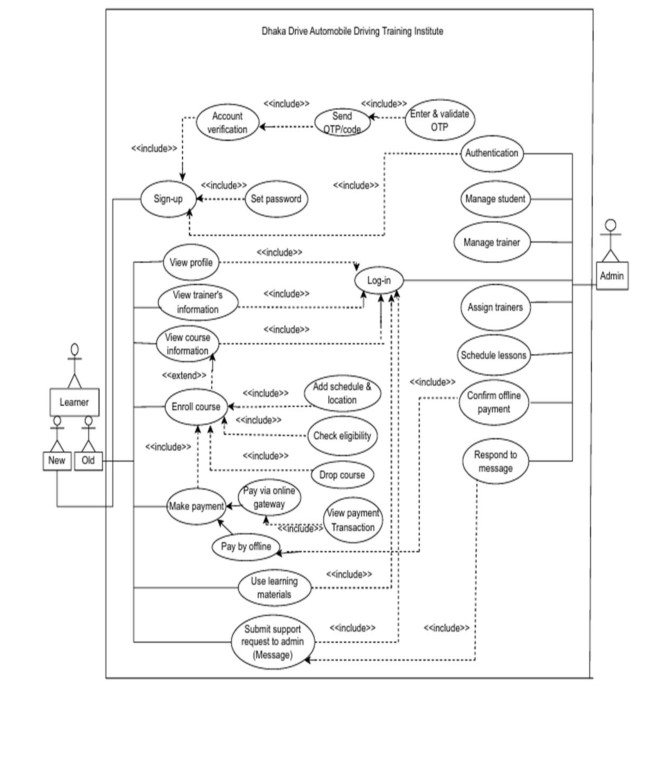

The use case diagram illustrates the interactions between two primary actors — **Learner** (New & Old) and **Admin** — with the system's core functionalities including Sign-up, OTP verification, Login, Course Enrollment, Payment, Learning Materials, and Messaging.

---

### Activity Diagrams

#### Login Flow
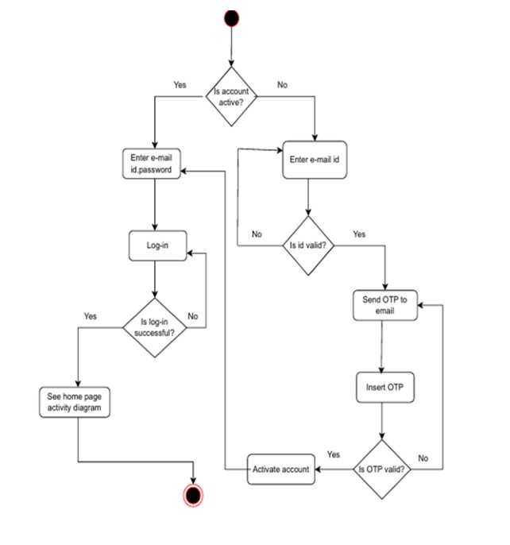

The login activity covers both active account login (email + password) and new/inactive account activation via OTP verification sent to the registered email.

---

#### Payment Flow
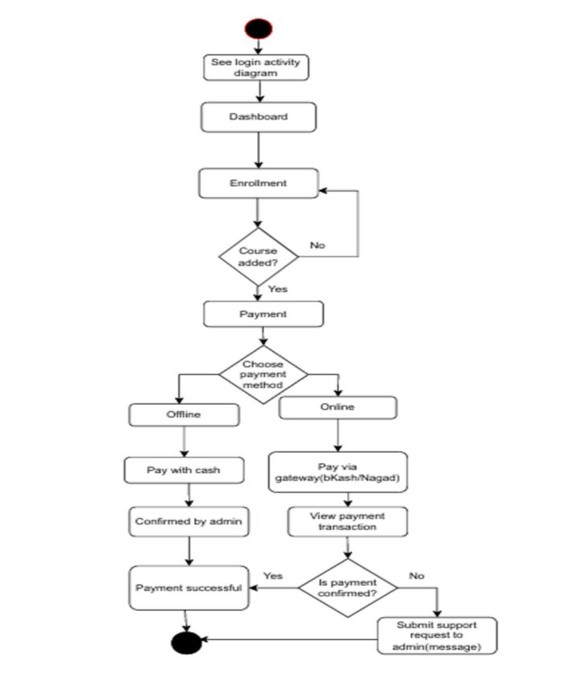

Students can pay via **online gateway (bKash/Nagad)** or **offline cash**. Online payments are confirmed via transaction ID; offline payments are confirmed manually by the admin.

---

#### Enrollment Flow
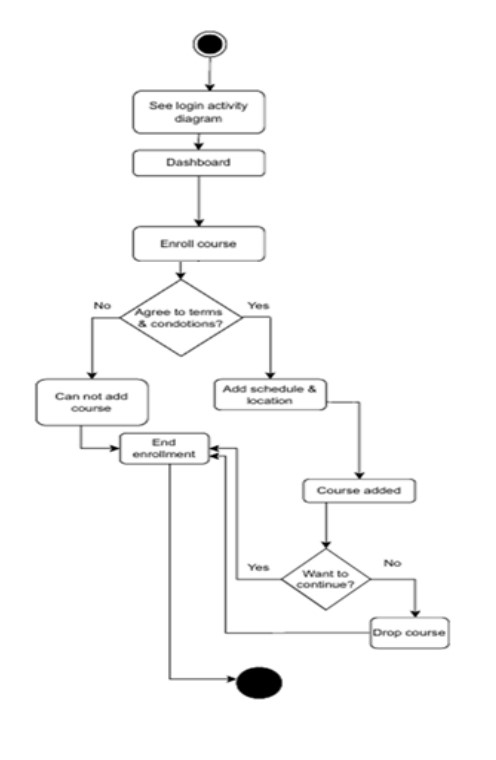

Students must agree to terms & conditions before selecting a schedule and location. They may drop the course at any point before confirmation.

---

#### Learning Material Access Flow
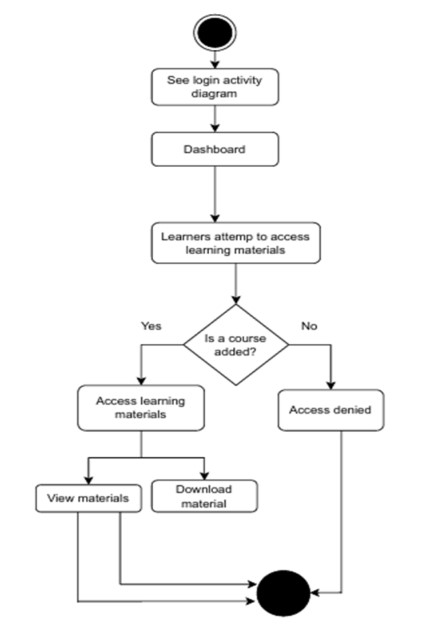

Access to learning materials is restricted to enrolled students only. Unenrolled learners receive an access-denied response.

---

### Class Diagram

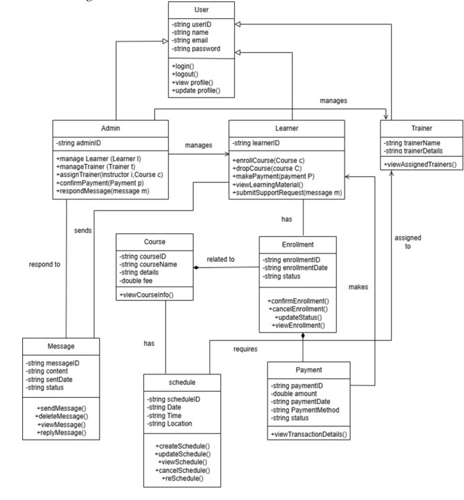

The class diagram shows the object-oriented structure of the system with classes: `User`, `Admin`, `Learner`, `Trainer`, `Course`, `Enrollment`, `Payment`, `Schedule`, and `Message` — with their attributes, methods, and relationships.

---

### Data Flow Diagram

#### Level 0 — Context Diagram
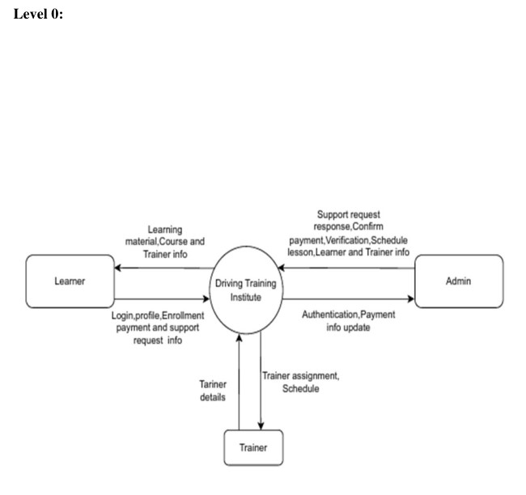

The context diagram shows the three external entities (**Learner**, **Admin**, **Trainer**) interacting with the central **Driving Training Institute** system.

---

#### Level 1 — Detailed DFD
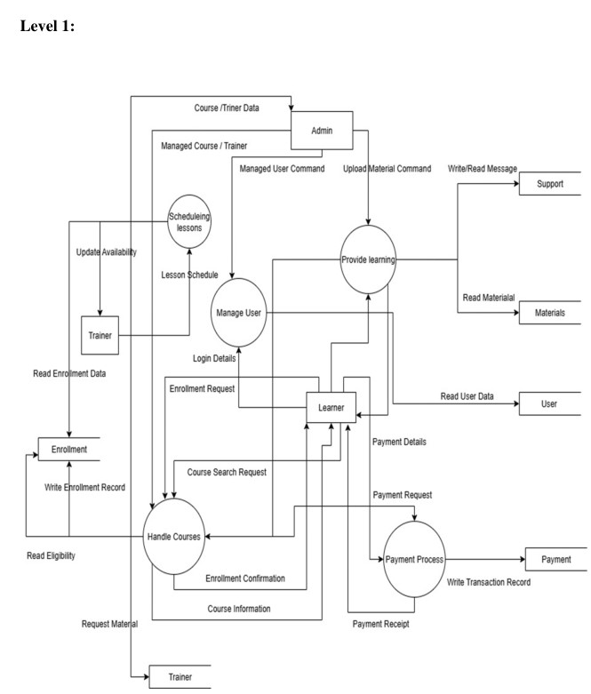

Level 1 breaks down the system into key processes: **Manage User**, **Scheduling Lessons**, **Handle Courses**, **Payment Process**, and **Provide Learning** — with their associated data stores and flows.

---

### ER Diagram

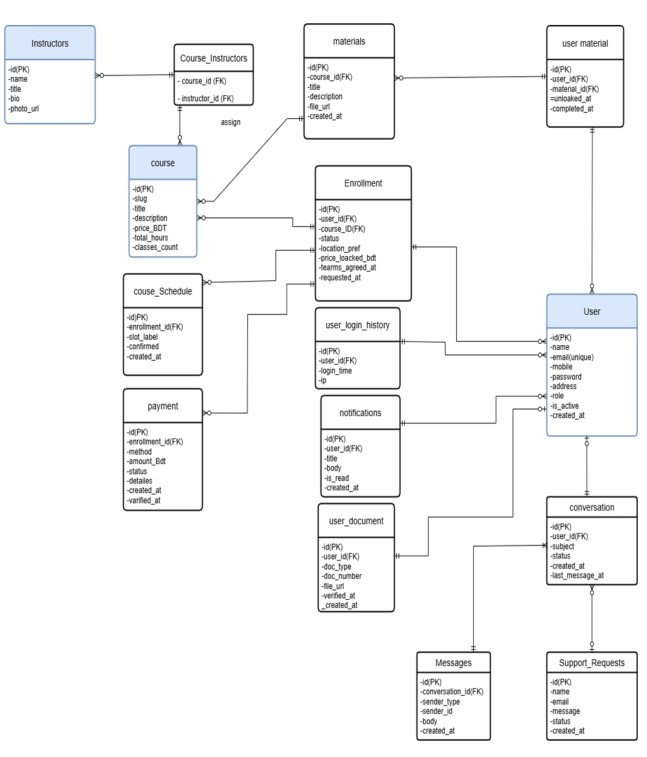

The Entity-Relationship diagram defines all entities and their relationships, including `User`, `Course`, `Enrollment`, `Payment`, `Course_Schedule`, `Instructors`, `Materials`, `Notifications`, `Messages`, `Conversation`, `user_document`, and `user_login_history`.

---

### Sequence Diagram

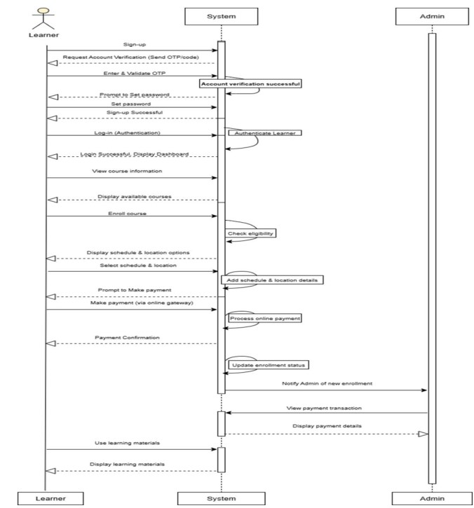

The sequence diagram traces the complete learner journey: Sign-up → OTP Verification → Login → View Courses → Enroll → Payment → Admin Notification → Access Learning Materials.

---

## 📸 Project Screenshots

### Homepage
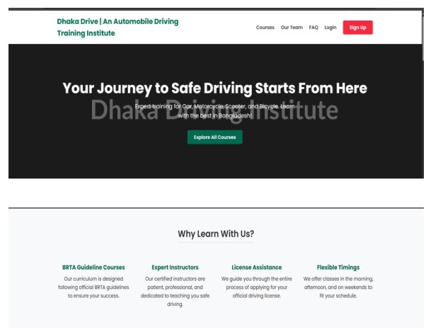

The landing page features a hero section, "Why Learn With Us?" highlights (BRTA Guideline Courses, Expert Instructors, License Assistance, Flexible Timings), and a course listing with Card and Motorcycle options.

---

### Course Detail & Enrollment
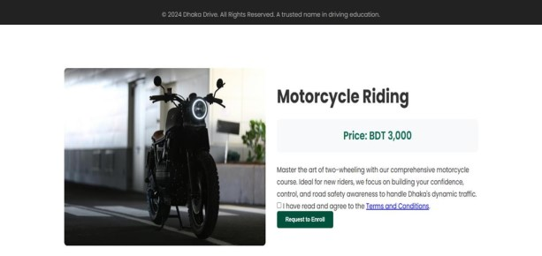

Individual course pages display pricing (e.g., Motorcycle Riding — BDT 3,000), course description, and a Terms & Conditions checkbox before submitting an enrollment request. The homepage also includes student testimonials.

---

### Our Driving Courses Section
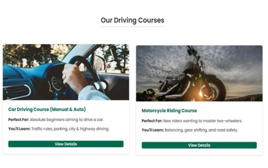

The homepage features a dedicated "Our Driving Courses" section showcasing the available courses as cards with images, a brief description of who the course is perfect for, what learners will gain, and a "View Details" button linking to the full course page.

---

### Student Testimonials & Contact Section
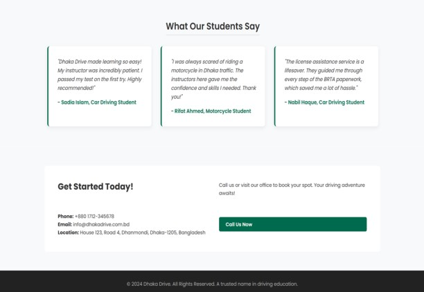

The "What Our Students Say" section highlights real student feedback. Below it, the "Get Started Today!" section provides the institute's phone number, email, and physical location (House 123, Road 4, Dhanmondi, Dhaka-1205), alongside a "Call Us Now" button.

---

## ⚙️ Installation & Setup

### Prerequisites
- PHP >= 7.4
- MySQL / MariaDB
- Apache Web Server
- XAMPP / WAMP / LAMP stack recommended

### Steps

1. **Clone the repository**
   ```bash
   git clone https://github.com/yourusername/dhakadrive.git
   cd dhakadrive
   ```

2. **Set up the database**
   - Open **phpMyAdmin** or your MySQL client
   - Create a database named `dhakadrive_db`
   - Import the SQL file:
     ```bash
     mysql -u root -p dhakadrive_db < dhakadrive_db.sql
     ```

3. **Configure database connection**
   - Open `config.php`
   - Update credentials if needed:
     ```php
     define('DB_SERVER', 'localhost');
     define('DB_USERNAME', 'root');
     define('DB_PASSWORD', '');
     define('DB_NAME', 'dhakadrive_db');
     ```

4. **Start your server**
   - Place the project folder inside `htdocs/` (XAMPP) or `www/` (WAMP)
   - Start Apache and MySQL from XAMPP Control Panel
   - Visit: `http://localhost/dhakadrive/`

5. **Login as Admin**
   ```
   URL:   http://localhost/dhakadrive/login.php
   Email: admin@dhakadrive.com
   ```

---

## 🚘 Courses Offered

| Course                        | Price (BDT) | Target Audience                            |
|-------------------------------|-------------|--------------------------------------------|
| Car Driving Course (Manual & Auto) | 5,000  | Absolute beginners learning to drive a car |
| Motorcycle Riding Course      | 3,000       | New riders mastering two-wheelers          |
| Scooter Riding Lessons        | 2,500       | Beginner scooter riders                    |
| Bicycle Safety Program        | 1,000       | All ages learning safe cycling             |

---

## 👨‍💻 Team Members

| Name              | Student ID       | Role                  |
|-------------------|------------------|-----------------------|
| Ahsiul Karim      | 2022-3-60-074    | Team Member           |
| Sadia Afrin       | 2022-2-60-088    | Team Member           |
| Tina Ali          | 2022-1-60-320    | Team Member           |
| Jahir Hasan Biddut | 2022-1-60-096   | Team Member           |

**Instructor:** Md. Sabbir Hossain, Lecturer — Dept. of Computer Science and Engineering, East West University

**Course:** Information System Analysis and Design (CSE347)  
**Submission Date:** August 30, 2025

---

## ⚠️ Limitations

1. **Limited Scalability** — Designed for Dhaka Drive specifically; customization needed for other institutes.
2. **Internet Dependency** — Online features (booking, progress tracking) require a stable internet connection.
3. **Hardware Constraints** — May have performance issues on low-end or older devices.
4. **Manual Entry Errors** — Attendance and test results rely on manual input, which may introduce errors.
5. **No Real-Time Feedback** — Practical driving performance evaluation is instructor-dependent; no automated real-time analysis.

---

## 🔮 Future Enhancements

- 📱 Mobile app integration (Android / iOS)
- 🎥 Real-time driving performance analysis using telematics
- 🤖 AI-based driving skill assessment
- 📧 Automated email/SMS notifications
- 🗺️ Google Maps integration for location-based scheduling
- 📜 Digital certificate generation and BRTA portal integration

---
